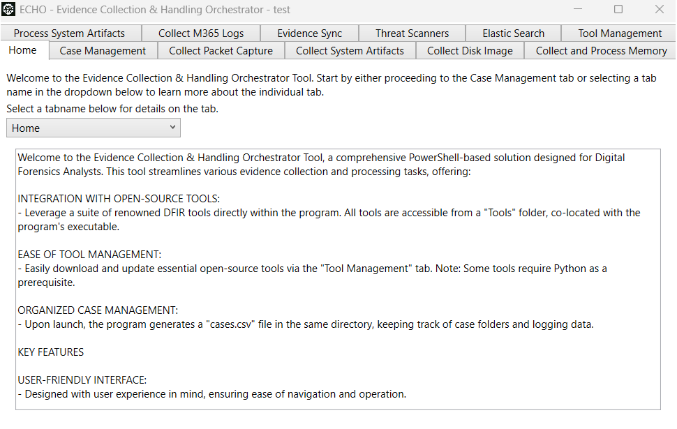

# ECHO User Guide

**ECHO (Evidence Collection & Handling Orchestrator)** is a PowerShell-based Digital Forensics and Incident Response (DFIR) program designed to aid in case management and the collection and processing of forensic data.

---

## Program Overview

ECHO offers a comprehensive suite of tools and features across various tabs, each dedicated to specific functions in the digital forensic process.

- **Integration with Open-Source Tools:** Leverage a suite of renowned DFIR tools directly within the program. All tools are accessible from a `Tools` folder, co-located with the program's executable.
- **Ease of Tool Management:** Easily download and update essential open-source tools via the "Tool Management" tab. _Note: Some tools require Python as a prerequisite._
- **Organized Case Management:** Upon launch, the program generates a `cases.csv` file in the same directory, keeping track of case folders and logging data.
- **User-Friendly Interface:** Designed with user experience in mind, ensuring ease of navigation and operation.
- **Comprehensive Case Tracking:** All activities and evidence processed are meticulously saved within each case folder for seamless case management.
- **Flexibility and Control:** Open, create, import, or delete cases with ease, giving you complete control over your case data.

---


## Getting Started

You can run ECHO either as a PowerShell script or as a compiled executable:

### Option 1: Run as a PowerShell Script

1. Clone or download this repository.
2. Open PowerShell and navigate to the project directory.
3. Run the following command:

    ```powershell
    .\_EchoMain.ps1
    ```

    *(Or run `ECHO_combined.ps1` if you use a combined script.)*

> **Note:** You may need to set the execution policy to allow running scripts. You can do this with:
>
> ```powershell
> Set-ExecutionPolicy -Scope Process -ExecutionPolicy Bypass
> ```

---

### Option 2: Run as a Compiled Executable

If you have downloaded or built the standalone executable (`ECHO.exe`):

1. Locate `ECHO.exe` in your build/output folder.
2. Double-click to launch, or run from PowerShell/cmd:

    ```
    .\ECHO.exe
    ```

---

**Requirements:**  
- Windows 10/11
- PowerShell 5.1 or later (for script version)
- .NET Framework 4.5+ (usually already included on modern Windows)

---

## Tab Overviews

### Home Tab
- **Detailed Tab Overview:** Learn about the various tabs via a dropdown menu.

### Case Management Tab
The Case Management tab streamlines your digital forensic investigation workflow. Key functionalities include:

- **Create New Case:** Enter a case name and select a storage directory. The program creates a dedicated folder for your case, complete with a tracking file (`<casename>.txt`) for logging activities.
- **Manage Existing Cases:** Access and manage ongoing investigations via the 'Existing Cases' dropdown. You can open or delete cases (deleting removes it from the program's records, but does **not** delete the actual folder).
- **Import Case:** Integrate external cases into the program by importing a `<casename>.txt` file.

---

### Collect and Process Memory Tab

Capture and analyze memory data—critical for digital forensics.

- **Memory Capture with WinPmem:** Set the path to the WinPmem executable and capture memory images quickly.
- **Process with Volatility 3:** Select a captured memory file, specify the OS type, and choose Volatility plugins for analysis. Define the path to the Volatility executable as needed.

---

### Collect Disk Image Tab

For creating forensic disk images using FTK Imager.

- **Display and Select Drives:** Click 'Display Drive(s) List' to view and select one or more drives for imaging.
- **FTK Imager Integration:** Use FTK Imager for reliable disk imaging. Configure the FTK executable if not automatically detected.
- **Create Disk Images:** Start imaging with the 'Collect Selected Drives' button.

---

### Collect M365 Logs Tab

Gather Microsoft 365 logs for forensic investigations.

- **Connect and Test Client Connection:** Connect to the Microsoft 365 tenant and verify connectivity.
- **Customize Log Collection:** Specify custom IPs or usernames, or use default triage arguments.
- **Selective Log Collection:** Choose log types such as Unified Audit Logs, Mailbox Audit Logs, Admin Logs, etc., and configure each with specific parameters.

---

### Collect Packet Capture Tab

Capture network packets using Windows' built-in tools.

- **Netsh Trace:** Use `netsh trace` to capture network packets without extra software.
- **Capture Duration Control:** Set packet capture duration (default: 5 minutes).
- **Convert ETL to PCAP:** Convert captured ETL files to PCAP format for analysis.
- **Extract CAB File:** Extract contents of CAB files for deeper review.

---

### Collect System Artifacts Tab

Gather crucial system data for analysis, leveraging Velociraptor.

- **Setup and Volume Selection:** Select a volume and targets for data collection.
- **Target Selection:** Choose from a list of artifact targets or reset to default (SANS_Triage).
- **Advanced Options:** Optionally include Volume Shadow Copies.
- **Velociraptor Integration:** Collect system artifacts efficiently. Specify the Velociraptor executable if needed.

---

### Elastic Search Tab

Search Elastic using Kibana and prewritten queries.

- **Kibana URL & Index Name:** Input your Kibana instance URL and target index.
- **Search Selection:** Pick from a variety of searches or use custom IOCs.
- **Open CustomIOCs.txt:** Edit your custom IOC list.
- **Launch Search:** Open results in your default browser.

---

### Evidence Sync Tab

Upload evidence to analysis and visualization platforms.

- **Platform Integration:** Connect with Timesketch, Splunk, Elastic, and others.
- **File and Folder Sync:** Select and upload files/folders directly from the case directory.
- **Configurable Parameters:** Customize sync for each platform.
- **Connection Testing & Index Management:** Test platform connectivity and manage index settings.

**Timesketch Specifics:** Configure server URLs, credentials, and sketch details for timeline synchronization.

---

### Process System Artifacts Tab

Process system artifacts using various forensic tools.

- **Tool Selection:** Use BulkExtractor, Zimmerman Tools, Plaso Timeline, and more.
- **Processing Options:** Analyze artifacts, extract archives, or perform IP geolocation.
- **Advanced Features:** Check VirusTotal, normalize data, export CSVs with custom date ranges/IOCs.

---

### Threat Scanners Tab

Scan for malware and vulnerabilities with ClamAV and Loki.

- **Flexible File/Folder Scanning:** Select files or folders to scan.
- **ClamAV & Loki Integration:** Detect viruses, IOCs, and more.
- **Customizable Scans:** Enable options like process scanning or vulnerability checks.
- **Output & Reporting:** Scan results saved in the `ProcessedArtifacts` folder.

---

### Tool Management Tab

Manage and update DFIR tools within the program.

- **Selection & Management:** Centralized tool management via dropdown.
- **Download/Update Tools:** Keep your forensic tools up to date.
- **Supported Tools:** 7zip, BulkExtractor, etl2pcapng, FTK Imager, and more.

---

## Conclusion

ECHO is a versatile DFIR tool designed to facilitate efficient and organized forensic investigations. Each tab in the GUI offers specific functionalities to enhance the digital forensic workflow.

---
“This project is for educational and DFIR professional use. Use at your own risk. The authors are not responsible for misuse or data loss.”
